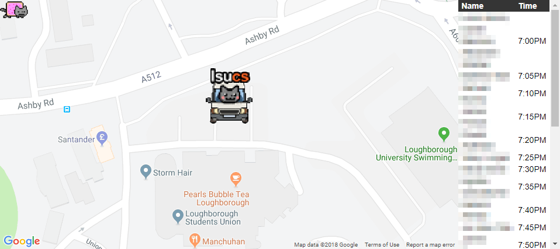
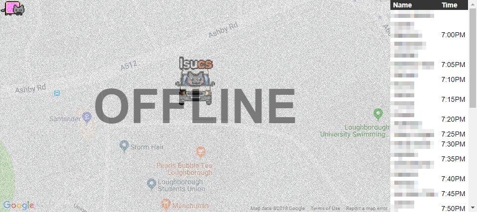

# lan-van

A [re-frame](https://github.com/Day8/re-frame) application designed to show the location of the lan van.

Notice: A quick project hacked together over a week or two.

## Prerequisites

You will need [Leiningen][1] 2.0 or above installed.

[1]: https://github.com/technomancy/leiningen

## Running

To start a web server for the application, run:

    lein clean
    lein figwheel dev

Or build the application using:

    lein cljsbbuild once min

And host the files in the `/resouces` directory.

## Online Version
[https://lanvan.lsucs.org.uk/](https://lanvan.lsucs.org.uk/)

## Picture
### Online

### Offline

